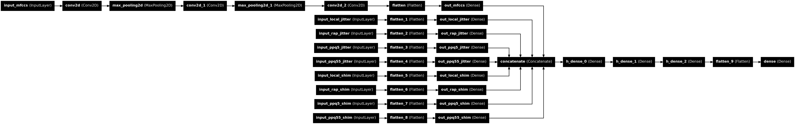

# fake_voices_xai

This repository is a setup for experiments using explainable models to classify deepfake/bona-fide audio samples.  
It consists of feature extraction functions and data preparation to create usable inputs for models as well as
a creation, training and evaluation setup for a traditional (not explainable) model, with the intent of using it as a surrogate for a later explainable model.
Implementation of explainability using LIME or similar is planned in the near future.

# Setup

In order to set-up the environment, use the provided anaconda environment contained within the 
environment.yml file:
```
conda env create -f environment.yml
```
Then, activate the environment using:
```
conda activate fake_voices
```

# Feature Extractors

In this repository, there are several feature extractors that are used to translate audio samples into useful 
input for classification models.  
IF a feature extractor is based on a feature which is novel and specific to certain research or from an article, it is cited in the comments of the code (references below). Standard features that are typical in detection models and not specific to certain research or articles, or features that are built in to existing libraries (for example MFCCs) are not cited.
research.  
  
The features used in this repository can be, as in my previous research, classified into perceptible and imperceptible features. Perceptible features are features that are able to be perceived by humans, such as vocal qualities, for example timbre, jitter or pitch fluctuations. Such features are often the reason that fake audio samples often sound somewhat "uncanny" to the ear. Imperceptible features, however, are features that are typically not able to be perceived by humans. These include spectrographic features, such as mel-spectrograms, and spectral coefficients, such as mel-frequency cepstral coefficients or linear frequency cepstral coefficients. Previous research has often concluded that the "problems" in fake audio samples identified using such features are often in very low or high frequency ranges, which can be classified as "speaker independent features" [[1]](#1).

# Datasets
To download the In-The-Wild Dataset:
```
https://owncloud.fraunhofer.de/index.php/s/JZgXh0JEAF0elxa/download
```

The dataset of ASVSpoof2021 DF can be found here:
```
https://zenodo.org/records/4835108
```
Datasets can be put in the `datasets` directory, which is in the .gitignore file.

# Models (traditional)
There are pickle dumps of trained models in the trained_models directory of this repository that can be used for evaluation or surrogate purposes. The file names are a summary of the features involved and the training.
- ItW_hnrs_melspec_mfcc_f0len: This model was trained with the following features on the entire In-The-Wild dataset:
	* Harmonic-noise ratios
	* Mel-spectrograms
	* MFCCs
	* Fundamental frequency lengths
- ItW_hnrs_melspec_mfcc_f0len_onsets_intensity_pitch_u9400: This model was trained on the first 9400 samples of the In-The-Wild dataset and evaluated on the rest. In evaluation, the model achieves an accuracy of 90,93% with a threshold of 0.5. It was trained on the following features:
	- Perceptible:
		* Harmonic-noise ratios
		* Fundamental frequency lengths
		* Onset strengths
		* Intensity
		* Pitch fluctuations
	- Imperceptible:
		* Mel-spectrograms
		* MFCCs
- ItW_multi_percep_until10000: This model was trained on the first 10000 samples of the In-The-Wild dataset and evaluated on the rest. In evaluation, the model achieves an accuracy of approximately 94,28% with a threshold of 0.5. The architecture of this model is pictured below. It was trained using the following features:
	- Perceptible:
		* Harmonic-noise ratios
		* Fundamental frequency lengths
		* Onset strengths
		* Intensity
		* Pitch fluctuations
		* Local jitter
		* Rap jitter
		* ppq5 jitter
		* ppq55 jitter
		* Local shimmer
		* Rap shimmer
		* ppq5 shimmer
		* ppq55 shimmer
	- Imperceptible:
		* Mel-spectrograms
		* MFCCs
\
\
### Architecture of the ItW_multi_percep_until10000 model


# Notes on Implementation

### Feature Extractors
For these experiments various feature are applied to given datasets, resulting in dataframes containing arrays of extracted features. These can be, for each sample in the dataset, ints, one-dimensional arrays or two-dimensional arrays.  
For increased efficiency, there is a generic implementation of multithreading for file-based feature extraction (in mt_operations).

### Data Preparation
In order to prepare data for input into neural networks, a standerdizes array shape is needed. Because the extraced features do not result in standardized array shapes a sliding window is passed over every array for standardization.  

### Networks
Each feature is processed separately by its own network. These networks are stitched together into a kind of meta-network to produce the end-classification.

### Training and Evaluation
Training is performed on batches of previously extracted features merged together and labelled.  
Evaluation is performed akin to training on batched of labelled features. Because of the nature of the sliding window over every file, there will be multiple evaluation results for every sample. These results are averaged and filtered by a threshold to produce a final result.

### Note
I have tried my best to include pydoc where it is relevant.

# References
<a id="1">[1]</a>
Xin Liu et al.  
“Hidden-in-Wave: A Novel Idea to Camouflage AI-Synthesized Voices Based on Speaker-Irrelative Features”. In: 2023 IEEE 34th International Symposium on Software Reliability Engineering (IS-SRE). 2023 IEEE 34th International Symposium on Software Reliability Engineering (ISSRE). Florence, Italy: IEEE, Oct. 9, 2023, pp. 786–794. isbn: 9798350315943. doi: 10 . 1109 / ISSRE59848 . 2023 . 00029. url: https : / / ieeexplore . ieee . org / document / 10301243/ (visited on 05/28/2024).  
<a id="2">[2]</a>
Anuwat Chaiwongyen et al.  
“Deepfake-speech Detection with Pathological Features and Multilayer Perceptron Neural Network”. In: 2023 Asia Pacific Signal and Information Processing Association Annual Summit and Conference (APSIPA ASC). 2023 Asia Pacific Signal and Information Processing Association Annual Summit and Conference (APSIPA ASC). Taipei, Taiwan: IEEE, Oct. 31, 2023, pp. 2182–2188. isbn: 9798350300673. doi: 10 . 1109 / APSIPAASC58517 . 2023 . 10317331. url: https://ieeexplore.ieee.org/document/10317331/ (visited on 05/28/2024).  
<a id="3">[3]</a>
Anuwat Chaiwongyen et al.  
“Contribution of Timbre and Shimmer Features to Deepfake Speech Detection”. In: 2022 Asia-Pacific Signal and Information Processing Association Annual Summit and Conference (AP-SIPA ASC). 2022 Asia Pacific Signal and Information Processing Association Annual Summit and Conference (APSIPA ASC). Chiang Mai, Thailand: IEEE, Nov. 7, 2022, pp. 97–103. isbn: 978-616-590-477-3. doi: 10.23919/APSIPAASC55919.2022.9980281. url: https://ieeexplore.ieee.org/document/9980281/ (visited on 05/28/2024).  
<a id="4">[4]</a>
Menglu Li, Yasaman Ahmadiadli, and Xiao-Ping Zhang.
“A Comparative Study on Physical and Perceptual Features for Deepfake Audio Detection”. In: Proceedings of the 1st International Workshop on Deepfake Detection for Audio Multimedia. MM ’22: The 30th ACM International Conference on Multimedia. Lisboa Portugal: ACM, Oct. 14, 2022, pp. 35–41. isbn: 978-1-4503-9496-3. doi: 10.1145/3552466.3556523. url: https://dl.acm.org/doi/10.1145/3552466.3556523 (visited on 05/11/2024).
<a id="5">[5]</a>
Zahra Khanjani et al.
“Learning to Listen and Listening to Learn: Spoofed Audio Detection Through Linguistic Data Augmentation”. In: 2023 IEEE International Conference on Intelligence and Security Informatics (ISI). 2023 IEEE International Conference on Intelligence and Security Informatics (ISI). Charlotte, NC, USA: IEEE, Oct. 2, 2023, pp. 01–06. isbn: 9798350337730. doi: 10.1109/ISI58743.2023.10297267. url: https://ieeexplore.ieee.org/document/10297267/ (visited on 05/28/2024).
